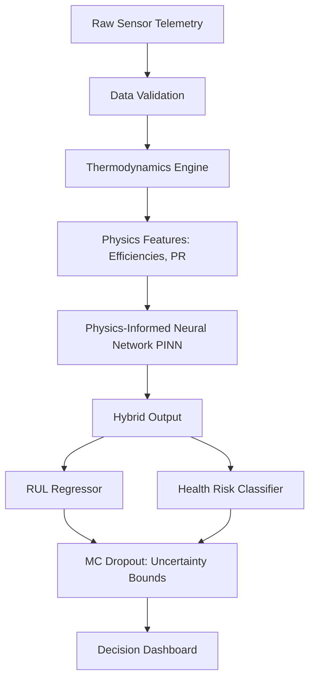

# System Architecture: Physics-Informed Digital Twin (PIDT)

This document provides an in-depth breakdown of the architecture we are building for the Aircraft Engine Predictive Maintenance System. The goal is to move away from purely data-driven "black-box" models and embrace a Physics-Informed Neural Network (PINN) that is interpretable, robust, and mathematically constrained by thermodynamics.

## 1. Overall Data Flow

The digital twin operates in a multi-layered pipeline:

## 2. The Components in Excruciating Detail

### A. The Thermodynamics Engine (`src/data_pipeline/thermodynamics.py`)
Standard ML feeds raw Temperatures (T2, T3) and Pressures (P2, P3) directly into a neural network. We intercept this data.
The `ThermodynamicsEngine` calculates physical invariants:

1. **Compressor Pressure Ratio ($PR_{comp}$):** 
   $$PR_{comp} = \frac{P_2}{P_{amb}}$$

2. **Isentropic Efficiency ($\eta_c$):** A measure of how much actual work is done compared to ideal work. It is calculated using the specific heat ratio of air ($\gamma = 1.4$) and the relationship between temperature and pressure ratios.
   $$\eta_c = \frac{ \left(\frac{P_2}{P_{amb}}\right)^{\frac{\gamma-1}{\gamma}} - 1 }{ \left(\frac{T_2}{T_{amb}}\right) - 1 }$$

By feeding these calculated features to the AI, we drastically reduce the complexity the AI needs to learn. It no longer has to discover the laws of physics on its own.

### B. The Physics-Informed Neural Network (`src/models/pinn.py`)
Built in PyTorch, this is a multi-head architecture:
1. **Shared Feature Extractor:** A series of dense layers that learn a common representation from the physical features.
2. **Monte Carlo (MC) Dropout:** During both training *and* inference, we randomly drop 30% of the neurons. By running the same data through the network 50 times (each with different dropped neurons), we get a distribution of answers. The mean is our prediction, and the variance gives us a **Confidence Interval**.
3. **Multi-Head Output:**
   - **Head 1:** Predicts Remaining Useful Life (RUL). Uses a `Softplus` activation to ensure the predicted RUL is always positive.
   - **Head 2:** Predicts categorical health risk (e.g., Healthy, Degrading, Critical).

### C. The Physics-Informed Loss Function (`src/models/loss.py`)
This is the most critical innovation. During backpropagation, the model is penalized based on three criteria:

$$ \mathcal{L}_{Total} = \alpha \cdot \mathcal{L}_{MSE}(\hat{RUL}, RUL) + \beta \cdot \mathcal{L}_{CE}(\hat{Risk}, Risk) + \gamma \cdot \mathcal{L}_{Physics} $$

Where the Physics Penalty ($\mathcal{L}_{Physics}$) is defined as:
$$ \mathcal{L}_{Physics} = \sum_{i} \text{ReLU}(\eta_c^{(i)} - 1.0)^2 + \sum_{i} \text{ReLU}(0.5 - \eta_c^{(i)})^2 $$

**The Calculus of Constraints:**
During gradient descent, the partial derivatives enforce the boundary conditions. If the model's weights imply $\eta_c > 1.0$ (an impossible efficiency), the gradient of the loss with respect to the weights $\theta$ becomes:
$$ \frac{\partial \mathcal{L}_{Total}}{\partial \theta} = \alpha \frac{\partial \mathcal{L}_{MSE}}{\partial \theta} + \gamma \cdot 2(\eta_c - 1.0) \frac{\partial \eta_c}{\partial \theta} $$

This massive gradient penalty forces the optimizer to step away from the unphysical region, trapping the neural network entirely within the realm of physical reality.

## 3. Deployment Architecture (Next Steps)
Once the model is trained in the Jupyter Notebook, it will be exported (e.g., via ONNX) and wrapped in a FastAPI microservice. A separate Python Telemetry Simulator will stream real-time flight cycle data via WebSockets to a Node.js/Vue.js dashboard, creating a true, live Digital Twin.
